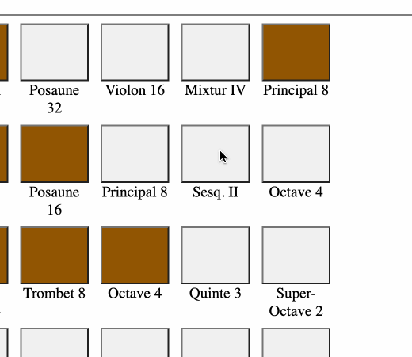
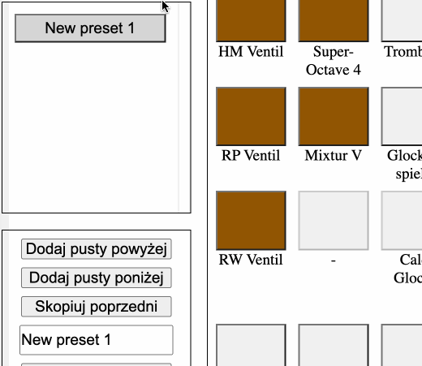
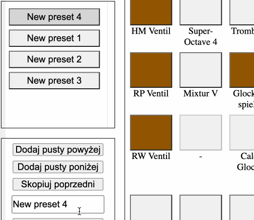
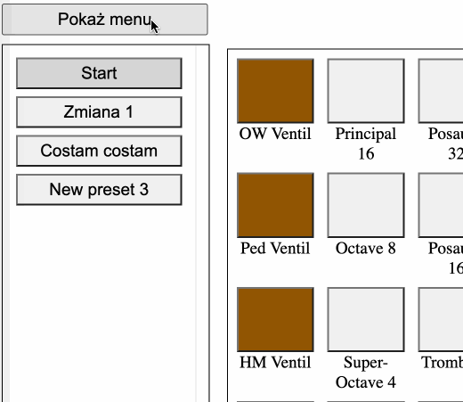
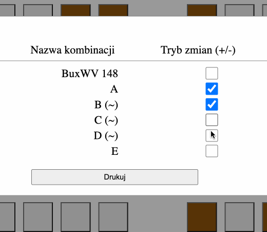

# Tutorial

## Basics
Application can be used on mobile phones, tablets and desktops, running on windows, 
linux, android, macOS, iOS, in (probably) all modern web browsers, but I would recommend **Chrome** on both - 
mobile and desktop devices.

### iOS
Some functionalities (pdf generating) may be not working properly on all iOS devices. 
Workaround is to export presets to `.englerjson` file and open it on
different, not-iOS device.

## Registration
Stops can be marked as attached by clicking on them, what causes color to change
in corresponding button.
It refers to stops in main panels, RP panel, ventils and coppels.

### Coppels
Coppels can be found in the middle, between left and right panels.

### Default stops
Some handles are set by default as attached - all ventils, light and motor.

## Presets
As multiple pieces requires multiple registrations, application provides way to create multiple presets (combinations).
New presets can be added with corresponding buttons.

### Renaming
Preset can be renamed by selecting it, and changing name in input, under `Add ...` buttons.

### Removing
Preset can be cleared, or deleted. Both actions triggers warning, before action is fulfilled.

## Sharing configs
Application provides interface to save current presets data, and load it later on any device. 
This feature can be useful f.e. for multiple pieces or parts, or just for backup purposes. This also 
allows moving all data to another platform, when iOS functionalities decide to fail.

All actions can be done in `Menu`, just by expanding it on top.

## Generating PDF

### Diff mode
Printing support 2 modes, state and difference mode. State mode marks stops which should be attached, 
diff mode shows which stops should be added and removed - what can be useful for changes within pieces. 

### Print
Finally, when all presets are done, you can generate pdf file from them, and later print, or open on another device.
As mentioned above, it's not 100% guaranteed, that this feature will work properly on iOS devices.

