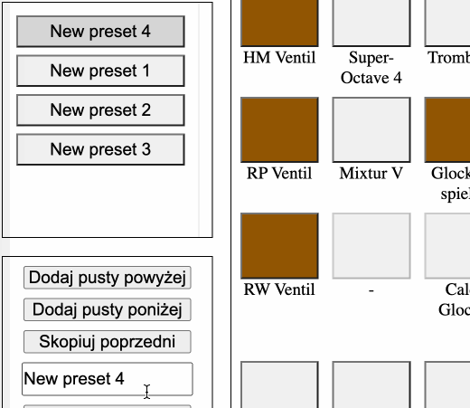

# English
[Click here](INSTRUCTION.md)

# e-registrant
Proste narzędzie do zapisywania registracji i generowania plików PDF do organów Englera we Wrocławiu.

# Co i czemu?
Głównym powodem powstania było wielokrotne wymyślanie na nowo sposobu notowania registracji, 
przez licznych artystów grających na tym instrumencie, często mało optymalnego, niczytelnego, 
i obarczonego błędem, wynikającym z zapisywania wszystkiego ręcznie. Zwielokrotniało to
wysiłek konieczny do wykonania dla registranta przed jak i po koncercie.

# Poradniczek

## Podstawy
Aplikacja działa na urządzeniach mobilnych jak i komputerach (rekomendowane). Zalecana przeglądarka, 
`chrome` i w miarę mozliwości, nie Apple.

## Registracja
Głosy 'załącza' się poprzez kliknięcie na odpowiednie manubrium, zmienia ono wtedy kolor na brązowy.
Tyczy się to wszystkich głosów, wentyli, oraz 2 połączeń manuałowych (po środku).

## Kombinacje
Jako że niektore utwory wymagaja zmian w trakcie, czasem licznych, aplikacja umożliwia tworzenie
kombinacji, a następnie jest w stanie przedstawić na wydruku różnice (czyli +, -, które głosy dodać, ktore usunąć).
Nowe kombinacje dodaje sie poprzez przyciski `Dodaj pusty ...`.

### Nazywanie kombinacji
Kombinacji mozna nadawać wlasne nazwy, modyfikując automatyczne, poniżej przycisku kopiowania.

### Usuwanie, kopiowanie, czyszczenie.
Dodatkowo w celu ułatwienia pracy z kombinacjami, dodane zostały opcje usuwania obecnej kombinacji, 
kopiowania zawartości poprzedniej do obecnej, oraz czyszczenia obecnej kombinacji.

## Zapisywanie konfiguracji
Aplikacja udostepnia możliwośc zapisania aktualnych kombinacji i załadowania ich na innych urządzeniach.
Dzięki temu można np kazdy utwor zapisac jako osobny plik konfiguracyjny. Daje to również możliwość
zachowania kombinacji na potem.

Wszystkie te akcje dostępne są w `Menu`.

## Generowanie PDF

### Tryb zmian (+/-)
Generowanie pliku PDF wspiera 2 tryby, tryb `stanu` i tryb `zmian`.
Tryb stanu zaznacza które głosy powinny być załączone w danym momencie. Tryb stanu
pokazuje różnice za pomocą `+` oraz `-` względem poprzednią kombinacją.

### iOS
W teorii wszystko działa, chociaz jakość PDF może być gorsza, polecam zapisac plik `.englerjson`,
otworzyć na komputerze i tam wygenerowac PDF.

